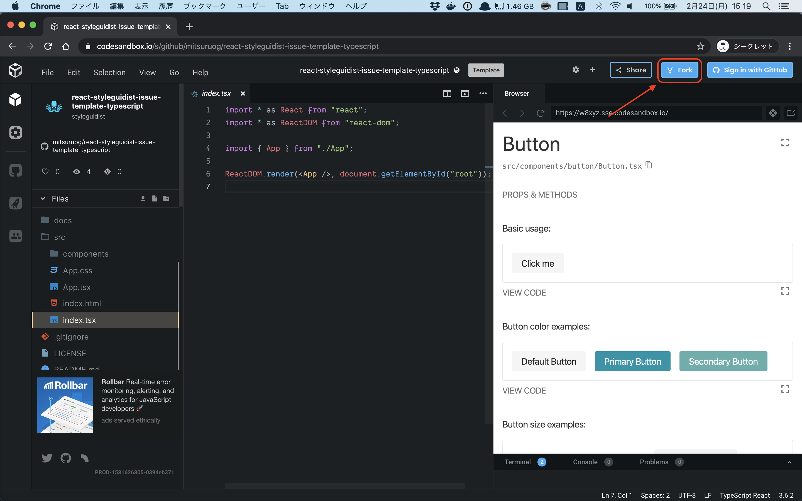

# react-styleguidist-issue-template-typescript

This is a minimum template project for reporting issue for [react-styleguidist](https://react-styleguidist.js.org).

## Basic usage

1. Go to the codesandbox template page.

- https://codesandbox.io/s/github/mitsuruog/react-styleguidist-issue-template-typescript

2. Fork it

3. Write your code and then share the sandbox URL.
